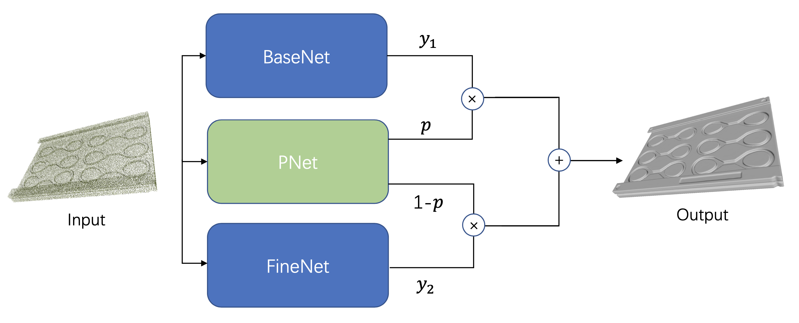

# MixNet (pytorch)

## Requirements

We recommend you to use anaconda to make sure that all dependencies are in place. The code is tested in the following setting:
- python == 3.8
- pytorch == 1.12.0
- CUDA == 11.3
- Packages: trimesh == 3.12.7, omegaconf == 2.2.2, tqdm == 4.64.0, scikit-image == 0.19.3, plotly == 5.9.0

## Dataset

The ABC dataset is used in this paer, you can visit their official website to download it.

We also provide several [examples](https://drive.google.com/drive/folders/17SBJX__rYpAySYqxEyaP8Cq-iO2JZOHQ?usp=sharing) for test our network.

## Usage

### Surface Reconstruction

MixNet can be used to reconstruct a high-quality surface given a point cloud with normal data. Adjust `config/config.yaml` to the path of the input point cloud:

    dataio:
    ...
    data_path: your data path
    ...

Then run the training script:

    python runner.py

You can change the GPU indexes and network configurations depending on your own needs:

    python runner.py --gpu INDEX --conf_path YOUR_OWN_CONF

According to `config/config.yaml`:

    dataio:
    expname: recon
    exps_folder_name: exp
    ...

After finishing the training, the reconstrution results can be found in the export folder: `..\exp\recon\`.
